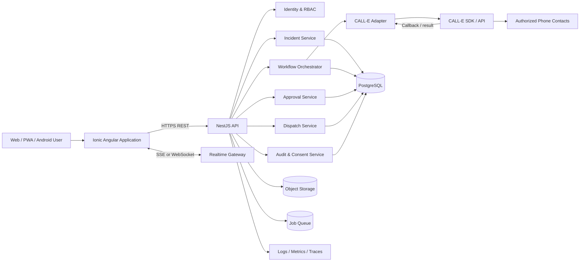

# System Architecture

## 1. High-level architecture



## 2. Frontend architecture

```text
apps/fieldrelay/
├── src/app/
│   ├── core/
│   │   ├── auth/
│   │   ├── http/
│   │   ├── realtime/
│   │   ├── error-handling/
│   │   ├── storage/
│   │   └── guards/
│   ├── shell/
│   │   ├── desktop-shell/
│   │   ├── tablet-shell/
│   │   ├── mobile-shell/
│   │   └── navigation/
│   ├── shared/
│   │   ├── ui/
│   │   ├── data-display/
│   │   ├── forms/
│   │   ├── charts/
│   │   └── utilities/
│   ├── features/
│   │   ├── mission-control/
│   │   ├── incidents/
│   │   ├── calls/
│   │   ├── dispatch/
│   │   ├── technicians/
│   │   ├── vendors/
│   │   ├── approvals/
│   │   ├── customers/
│   │   ├── analytics/
│   │   ├── audit/
│   │   ├── knowledge/
│   │   └── settings/
│   └── state/
└── capacitor.config.ts
```

### Frontend rules

- standalone Angular components or clearly separated feature modules
- strict TypeScript
- RxJS for event streams and request composition
- signals or a dedicated store for view state; do not mix patterns arbitrarily
- route-level lazy loading
- API models generated or derived from contracts
- presentational components remain free from direct HTTP calls
- centralized theme tokens
- no feature component may contain hard-coded hexadecimal colours
- route components coordinate data; reusable components render state

## 3. Backend architecture

```text
services/api/
├── src/
│   ├── modules/
│   │   ├── identity/
│   │   ├── organizations/
│   │   ├── customers/
│   │   ├── properties/
│   │   ├── incidents/
│   │   ├── call-e/
│   │   ├── workflows/
│   │   ├── approvals/
│   │   ├── dispatch/
│   │   ├── vendors/
│   │   ├── technicians/
│   │   ├── notifications/
│   │   ├── audit/
│   │   ├── consent/
│   │   ├── knowledge/
│   │   └── analytics/
│   ├── common/
│   │   ├── auth/
│   │   ├── idempotency/
│   │   ├── validation/
│   │   ├── errors/
│   │   ├── observability/
│   │   └── persistence/
│   └── jobs/
└── test/
```

## 4. Workflow execution model

A phone workflow is not executed inside an HTTP request.

```text
UI starts workflow
  → API validates policy and consent
  → workflow instance persisted
  → call job queued
  → worker invokes CALL-E
  → result or callback received
  → signature and idempotency checked
  → structured result validated
  → domain event appended
  → workflow state transition evaluated
  → approval, retry, escalation or dispatch created
  → realtime update sent to UI
```

## 5. Reliability requirements

- every external request has a timeout
- all call initiation requests use idempotency keys
- callbacks may be safely replayed
- state transitions use optimistic locking or serialized execution
- retries use exponential backoff and policy limits
- poison jobs move to a dead-letter queue
- workflow resumption is possible after process restart
- a completed CALL-E task cannot be processed twice
- partial structured output is stored separately from validated output

## 6. Recommended infrastructure

### Hackathon-friendly deployment

- Frontend: Firebase Hosting, Vercel, Netlify, Cloudflare Pages, or AWS Amplify
- API: Railway, Render, Fly.io, Google Cloud Run, or AWS App Runner
- PostgreSQL: Supabase, Neon, CockroachDB, or managed PostgreSQL
- Object storage: S3-compatible bucket
- Queue: BullMQ/Redis or managed queue
- Monitoring: OpenTelemetry + hosted logs

### Production direction

- containerized API and workers
- managed PostgreSQL with point-in-time recovery
- managed Redis or queue
- secrets manager
- WAF and rate limiting
- private service networking where supported
- structured logs, traces and alerts

## 7. Environment model

```text
local       — developer services and safe test numbers
preview     — branch deployment with simulation by default
staging     — integration environment with approved real-call allowlist
production  — controlled release with formal consent and retention policies
judge       — stable seeded environment with documented safe workflow
```

## 8. Configuration boundaries

Server-only secrets:

- CALL-E credentials
- database credentials
- signing keys
- webhook secrets
- messaging provider credentials
- object-storage credentials

Client-safe configuration:

- public API base URL
- feature flags without secrets
- build version
- support URL
- environment name

## 9. API versioning

Use `/api/v1` for public application endpoints. Backward-incompatible changes require a new version or an explicit migration period.

## 10. Observability

Every workflow must be traceable using:

- `correlationId`
- `incidentId`
- `workflowId`
- `callTaskId`
- `approvalId`
- `dispatchId`

Do not log raw secrets, full phone numbers, or unredacted transcripts.
