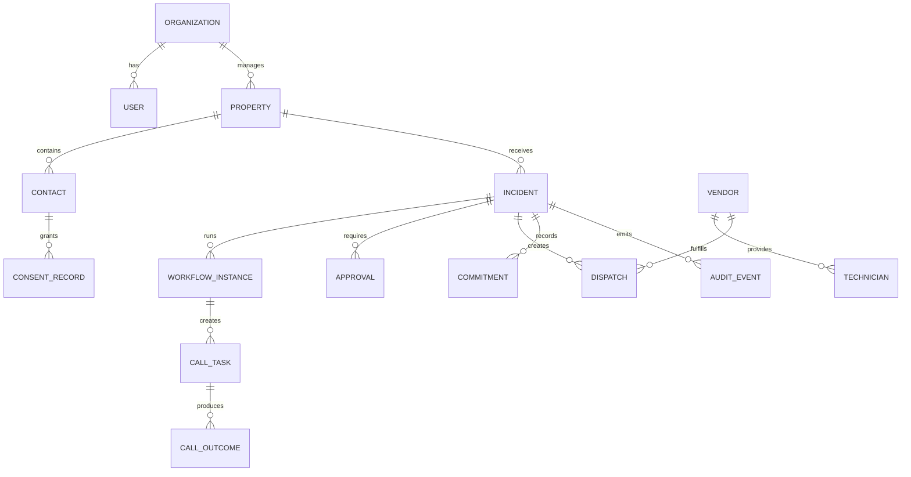

# Information Architecture

## Primary navigation

1. Mission Control
2. Incidents
3. Calls & AI Operations
4. Dispatch
5. Technicians
6. Vendors
7. Approvals
8. Customers
9. Analytics
10. Audit & Consent
11. Knowledge Base
12. Settings

## Navigation principles

- Mission Control is the operational home, not a marketing dashboard.
- Incidents are the central domain object.
- Calls are visible as operational execution, not hidden inside incident notes.
- Dispatch is a separate workspace because scheduling and workload require a spatial/time model.
- Approvals have a first-class queue because they can block resolution.
- Audit and consent are visible product capabilities, not administrative footnotes.

## Object relationships

## Page purpose summary

### Secure Sign In
Authenticate organization users and establish secure context.

### Mission Control
Show live operational health, active calls, queue, approvals, workflow progress and activity.

### Incidents
Search, filter and manage all incidents.

### Incident Detail
Provide the authoritative incident record, commitment timeline, communications, evidence and next actions.

### Create Incident
Capture verified data and configure the initial phone workflow.

### Calls & AI Operations
Monitor live, queued and completed CALL-E tasks with transcripts and structured outcomes.

### Dispatch Board
Assign incidents to vendors or technicians using availability, location, SLA and workload.

### Technicians
Review technician availability, skills, performance and assignment suitability.

### Vendor Detail
Review vendor performance, compliance, rates, service area and availability.

### Approvals
Make accountable decisions with the evidence and policy context required.

### Customers & Properties
Manage operational contacts, managed properties and location health.

### Analytics
Measure incident, call, SLA, vendor and resolution performance.

### Audit & Consent
Review immutable events, authorization, disclosure, retention and data controls.

### Knowledge Base
Access approved procedures and grounded operational answers.

### Settings
Manage organization, themes, automation policies, integrations, roles, security and retention.

## Search model

Global search should support:

- incident ID and title
- property and unit
- contact name and phone suffix
- vendor and technician
- call task ID
- approval ID
- dispatch ID
- knowledge document

Search results must respect organization and role permissions.
