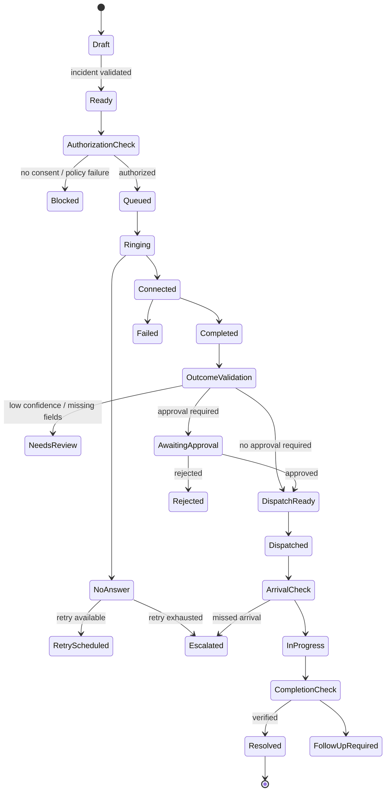

# CALL-E Workflow Architecture

## 1. Integration objective

CALL-E is the real-world phone execution layer. FieldRelay owns the operational context, authorization, workflow state, structured result validation, approval policy, dispatch, audit and user experience.

## 2. Adapter boundary

Create a backend `CallEAdapter` so the domain does not depend directly on vendor-specific request and response objects.

```ts
interface StartCallTaskCommand {
  idempotencyKey: string;
  workflowId: string;
  incidentId: string;
  authorizedContactId: string;
  phoneNumberToken: string;
  purpose: string;
  scriptContext: Record<string, unknown>;
  expectedOutcomeSchema: Record<string, unknown>;
  disclosurePolicyId: string;
  timeoutSeconds: number;
}

interface CallTaskResult {
  providerTaskId: string;
  status: 'queued' | 'ringing' | 'connected' | 'completed' | 'failed' | 'no_answer';
  startedAt?: string;
  completedAt?: string;
  transcriptRef?: string;
  rawOutcome?: unknown;
  structuredOutcome?: Record<string, unknown>;
  confidence?: number;
  failureCode?: string;
}
```

## 3. Workflow state machine



## 4. Structured vendor outcome

Recommended schema:

```json
{
  "answeredBy": "dispatcher",
  "available": true,
  "technicianName": "Alex Turner",
  "etaMinutes": 22,
  "estimate": {
    "currency": "USD",
    "minimum": 245,
    "maximum": 245,
    "taxIncluded": false
  },
  "accessRequirements": ["building entry confirmation"],
  "materialsLikelyRequired": ["mixer valve", "sealant"],
  "followUpRequired": false,
  "notes": "Technician is licensed and currently 2.1 miles away."
}
```

Validate:

- schema
- type correctness
- business constraints
- currency and amount limits
- ETA range
- authorization scope
- confidence threshold

Do not dispatch directly from unvalidated free text.

## 5. Call types

### Vendor availability call

Collect availability, technician, ETA, estimate and constraints.

### Tenant access confirmation

Confirm presence, access window, safety status and contact preference.

### Technician arrival check

Confirm arrival or revised ETA.

### Missed commitment escalation

Confirm reason, recovery plan and revised commitment.

### Completion confirmation

Confirm work completed, affected area safe and follow-up requirement.

## 6. Safety and consent

Before every call:

- verify organization ownership
- verify contact authorization
- verify call purpose allowed by policy
- verify number is in the environment allowlist for staging/judge mode
- load disclosure text
- avoid sending secrets or unnecessary personal information

During/after every call:

- store provider identifiers
- redact sensitive content where possible
- separate raw result from validated domain result
- attach confidence and evidence
- record audit event

## 7. Retry policy

Example policy:

| Priority | Retry count | Delay | Escalation |
|---|---:|---:|---|
| Critical | 2 | 60 sec, 3 min | backup vendor + human alert |
| High | 2 | 5 min, 10 min | next approved vendor |
| Medium | 1 | 15 min | queue for dispatcher |
| Low | 1 | 30 min | asynchronous follow-up |

Retry policy must be configurable. Never create unbounded call loops.

## 8. Human approval gates

Approval may be required for:

- cost above policy threshold
- vendor not on preferred list
- contacting additional parties
- changing appointment window
- emergency authorization
- account credit or compensation
- escalation with regulatory or safety implications

## 9. Live UI events

Recommended event types:

```text
call.task.queued
call.task.ringing
call.task.connected
call.transcript.partial
call.outcome.received
call.outcome.validated
call.task.failed
workflow.approval.requested
workflow.retry.scheduled
workflow.escalated
dispatch.created
commitment.recorded
commitment.missed
incident.resolved
```

## 10. Demo safety

- use numbers owned by or explicitly authorized for the demo
- label seeded scenarios clearly
- prevent judges from entering arbitrary phone numbers
- provide resettable demo data
- use simulation for dangerous or impractical branches, but do not misrepresent simulated events as real calls
